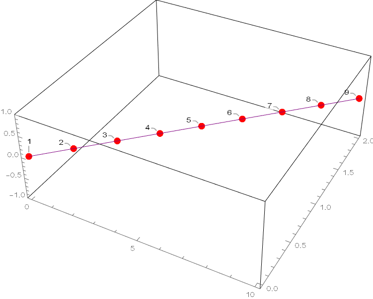
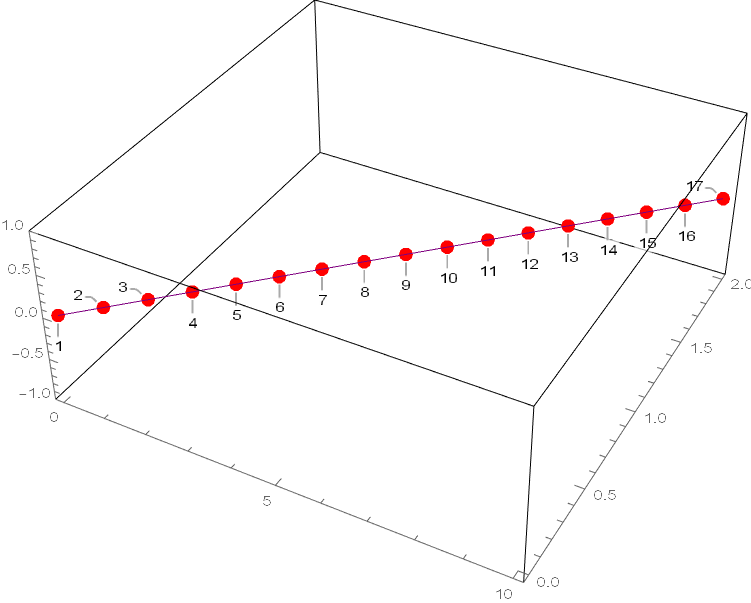
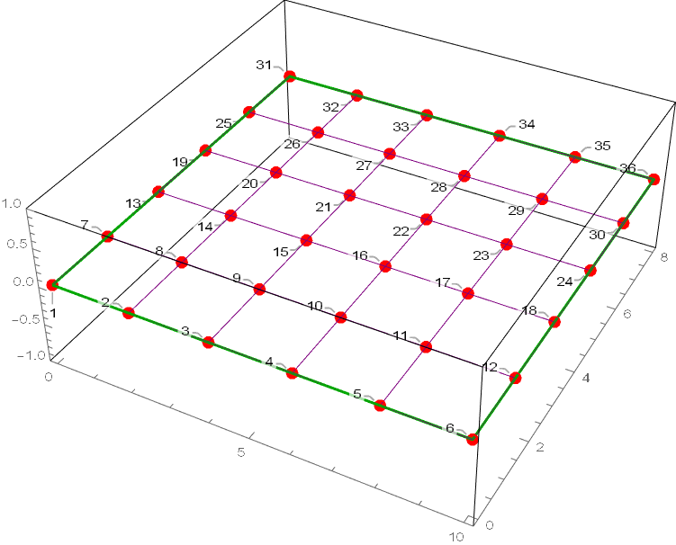
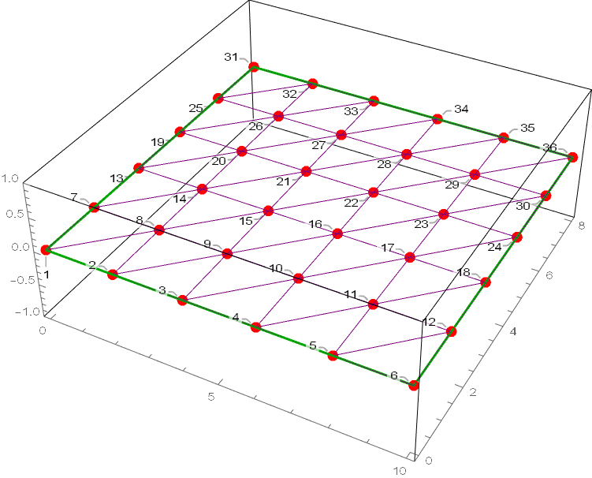
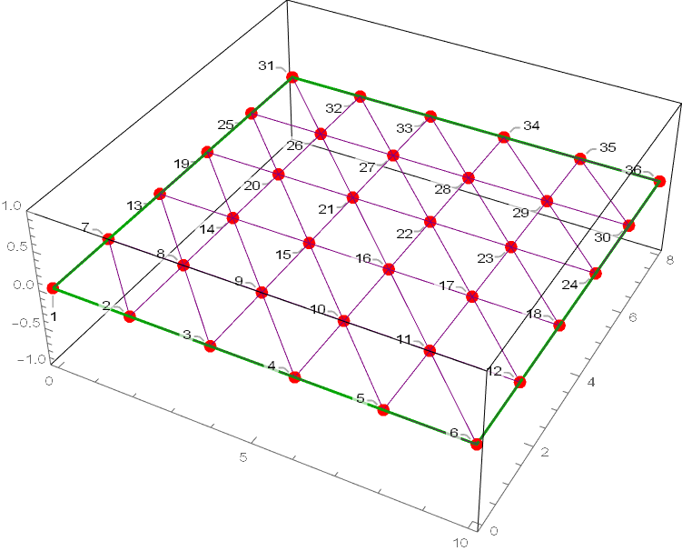
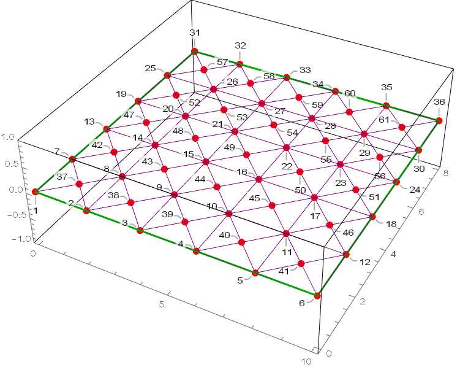

# FEM 

Contains various grid builders for finite element method. Grid builders implemented in C++, visualization done through "Wolfram Mathematica" package.

## 1D grids

1D area - line defined by 2 points in space.

* Linear elements

* Quadratic elements

## 2D grids

2D area - 2nd order surface defined by 4 points in space.

* Elements with quadrilateral base

* Elements with triangular base ver. 1

* Elements with triangular base ver. 2

* Elements with triangular base ver. 3

## Usage

| Input file format                          |                                                                            |
|--------------------------------------------|----------------------------------------------------------------------------|
| NP                                         | Number of points defining the area (2 or 4) clockwise                      |
| x_1 y_1 z_1  ...  x_NP y_NP z_NP | Point coords                                                               |
| NE1 NE2                                    | Number of elements on a line (1 value for 2 points, 2 values for 4 points) |
| type                                       | Type of the element (for 2 point - 1 or 2, for 4 point - 1, 2, 3 or 4)     |

NOTE: By default both "main.cpp" and "Visualization.nb" look for files in the current folder.

| Output file format                                                                              |                                                                                               |
|-------------------------------------------------------------------------------------------------|-----------------------------------------------------------------------------------------------|
| NE NP NC                                                                                        | NE - number of elements,  NP - number of point,  NC - number of contours            |
| EN_1 ENP_1 EP_1 ... EP_ENP_1  ... EN_NE ENP_NE EP_1 ... EP_ENP_NE                     | EN - element id,  ENP - number of vertices in the element,  {EP} - element vertices |
| PN_1 x_1 y_1 z_1  ...  PN_NP x_NP y_NP z_NP                                           | PN - vertex id, {x, y, z} - vertex coords                                                     |
| CPN_1 CPN_NC  CP_1  ...  CP_CPN_1  ...  CP_1  ...  CP_CPN_NC | CPN - number of vertices forming a contour,  {CP} - contour vertices                     |

## Requirements

To launch "Visualization.nb" one may need an access to a valid Wolfram Mathematica license.

## Version History

* 00.04
    * Fixed an oversight that caused incorrect behaviour when 3rd point didn't belong to the same plane as others

* 00.03
    * Generalized method interface

* 00.02
    * Implemented 6 separate grid builders

* 00.01
    * Initial release

## License

This project is licensed under the MIT License - see the LICENSE.md file for details
